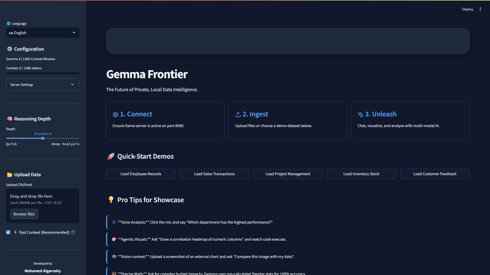

# 💎 Gemma 4 Data Assistant — Showcase

[🇺🇸 English](#-gemma-4-data-assistant--showcase) | [🇸🇦 العربية](#-مساعد-بيانات-gemma-4--معرض-المميزات)

<div align="center">
  
</div>

---

A **local-first, offline AI data analyst** powered by Google's Gemma 4 E4B model. Upload CSV/Excel files, chat with your data, generate charts, export Excel reports — all running on your own machine with zero cloud dependencies.

[](https://python.org)
[](https://streamlit.io)
[](https://ai.google.dev/gemma)
[](https://github.com/ggml-org/llama.cpp)
[](LICENSE)

---

## ✨ Feature Gallery

<table>
<tr>
  <td width="50%">
    <a href="showcase/voice.png"></a>
    <p align="center"><b>🎙️ Offline Voice-to-Text</b><br>
    <em>Native Gemma 4 ASR. 100% local — no internet required.</em></p>
  </td>
  <td width="50%">
    <a href="showcase/chart.png"></a>
    <p align="center"><b>📊 AI-Generated Charts</b><br>
    <em>Dynamic Matplotlib/Seaborn charts created via agentic tool execution.</em></p>
  </td>
</tr>
<tr>
  <td width="50%">
    <a href="showcase/excel.png"></a>
    <p align="center"><b>💾 Excel Report Generation</b><br>
    <em>AI builds formatted Excel workbooks with tables, charts, and summaries.</em></p>
  </td>
  <td width="50%">
    <a href="showcase/reasoning.png"></a>
    <p align="center"><b>🧠 Deep Reasoning</b><br>
    <em>Watch the AI think step-by-step with transparent reasoning tabs.</em></p>
  </td>
</tr>
<tr>
  <td width="50%">
    <a href="showcase/arabic.png"></a>
    <p align="center"><b>🌐 Bilingual EN/AR with RTL</b><br>
    <em>Full Arabic UI, right-to-left layout, Arabic chart text rendering.</em></p>
  </td>
  <td width="50%">
    <a href="showcase/vision.png"></a>
    <p align="center"><b>👁️ Vision / Image Analysis</b><br>
    <em>Upload screenshots, compare external charts, analyze images with AI.</em></p>
  </td>
</tr>
<tr>
  <td width="50%">
    <a href="showcase/context.png"></a>
    <p align="center"><b>⚡ Context Window Management</b><br>
    <em>128K token context, auto-trimming, real-time usage meter with overflow warnings.</em></p>
  </td>
  <td width="50%">
    <a href="showcase/terminal.png"></a>
    <p align="center"><b>🚀 Hardware-Optimized Server</b><br>
    <em>Flash Attention, KV cache quantization, speculative decoding for RTX 4060 8GB.</em></p>
  </td>
</tr>
</table>

---

## 🚀 Quick Start

```bash
# 1. Start the optimized server
./llama-opencode.bat

# 2. Launch the app
.venv\Scripts\Activate.ps1
streamlit run app.py
```

Then open `http://localhost:8501`, upload a CSV/Excel file, and start chatting.

---

## ⚙️ Tech Specs

| Component | Detail |
|---|---|
| **Model** | Gemma 4 E4B (4B effective params, 42 layers) |
| **Quantization** | Unsloth Dynamic Q4_K_XL (5.1 GB) |
| **Context** | 128K tokens with KV q4_0 cache quantization |
| **Architecture** | Hybrid sliding window (SWA) + global attention |
| **Modalities** | Text, Image, Audio (native Conformer ASR) |
| **Server** | llama.cpp `llama-server` with OpenAI-compatible API |
| **Optimizations** | Flash Attention, SWA full cache, ngram speculative decoding |
| **VRAM Usage** | ~7.0 GB / 8 GB on RTX 4060 Laptop |
| **Inference** | Full GPU offload via Vulkan backend |

---

> **100% Private & Local** — No data, audio, or images ever leave your machine.

---

<br><br>

# 💎 مساعد بيانات Gemma 4 — معرض المميزات

<div align="center">
  
</div>

---

**محلل بيانات ذكي محلي بالكامل** يعمل بنموذج Google Gemma 4 E4B. ارفع ملفات CSV/Excel، تحدث مع بياناتك، أنشئ رسوماً بيانية، وصدر تقارير Excel — كل شيء يعمل على جهازك بدون أي اعتماد على السحابة.

---

## ✨ معرض المميزات

<table>
<tr>
  <td width="50%">
    <a href="showcase/voice.png"></a>
    <p align="center"><b>🎙️ تحويل الصوت إلى نص بدون إنترنت</b><br>
    <em>التعرف الصوتي الأصلي لـ Gemma 4. 100% محلي.</em></p>
  </td>
  <td width="50%">
    <a href="showcase/chart.png"></a>
    <p align="center"><b>📊 رسوم بيانية بالذكاء الاصطناعي</b><br>
    <em>رسوم Matplotlib/Seaborn ديناميكية عبر تنفيذ أدوات ذكية.</em></p>
  </td>
</tr>
<tr>
  <td width="50%">
    <a href="showcase/excel.png"></a>
    <p align="center"><b>💾 إنشاء تقارير Excel</b><br>
    <em>الذكاء الاصطناعي يبني مصنفات Excel منسقة بجداول ورسوم وملخصات.</em></p>
  </td>
  <td width="50%">
    <a href="showcase/reasoning.png"></a>
    <p align="center"><b>🧠 تفكير عميق وشفاف</b><br>
    <em>شاهد الذكاء الاصطناعي يفكر خطوة بخطوة مع تبويبات تفكير شفافة.</em></p>
  </td>
</tr>
<tr>
  <td width="50%">
    <a href="showcase/arabic.png"></a>
    <p align="center"><b>🌐 دعم ثنائي اللغة مع تخطيط RTL</b><br>
    <em>واجهة عربية كاملة، تخطيط من اليمين لليسار، رسوم بيانية عربية.</em></p>
  </td>
  <td width="50%">
    <a href="showcase/vision.png"></a>
    <p align="center"><b>👁️ تحليل الصور</b><br>
    <em>ارفع لقطات شاشة، قارن رسوماً بيانية خارجية، حلل الصور بالذكاء الاصطناعي.</em></p>
  </td>
</tr>
<tr>
  <td width="50%">
    <a href="showcase/context.png"></a>
    <p align="center"><b>⚡ إدارة نافذة السياق</b><br>
    <em>سياق 128K، تقليص تلقائي، عداد استهلاك مع تحذيرات تجاوز الحد.</em></p>
  </td>
  <td width="50%">
    <a href="showcase/terminal.png"></a>
    <p align="center"><b>🚀 خادم مُحسّن للأجهزة</b><br>
    <em>Flash Attention، KV cache quantization، speculative decoding لـ RTX 4060 8GB.</em></p>
  </td>
</tr>
</table>

---

## 🚀 البدء السريع

```bash
# 1. شغّل الخادم المُحسّن
./llama-opencode.bat

# 2. شغّل التطبيق
.venv\Scripts\Activate.ps1
streamlit run app.py
```

ثم افتح `http://localhost:8501` وارفع ملف CSV/Excel وابدأ المحادثة.

---

## ⚙️ المواصفات التقنية

| المكون | التفاصيل |
|---|---|
| **النموذج** | Gemma 4 E4B (4 مليار معلمة فعالة، 42 طبقة) |
| **الضغط** | Unsloth Dynamic Q4_K_XL (5.1 جيجابايت) |
| **السياق** | 128 ألف رمز مع ضغط KV q4_0 |
| **المعمارية** | نافذة منزلقة هجينة (SWA) + انتباه عالمي |
| **الوسائط** | نص، صورة، صوت (Conformer ASR أصلي) |
| **الخادم** | llama.cpp `llama-server` مع واجهة OpenAI |
| **التحسينات** | Flash Attention، SWA full cache، ngram speculative decoding |
| **استهلاك VRAM** | ~7.0 / 8 جيجابايت على RTX 4060 Laptop |
| **الاستدلال** | GPU كامل عبر Vulkan |

---

> **خصوصية كاملة ومحلية 100%** — لا تغادر أي بيانات أو صوت أو صور جهازك أبداً.

---

<div align="center">
  <p>
    <a href="https://github.com/malgaroshy-maker/gemma4-data-assistant">⭐ Star on GitHub</a> •
    <a href="showcase/showcase.html">🌐 View Web Version</a>
  </p>
</div>
